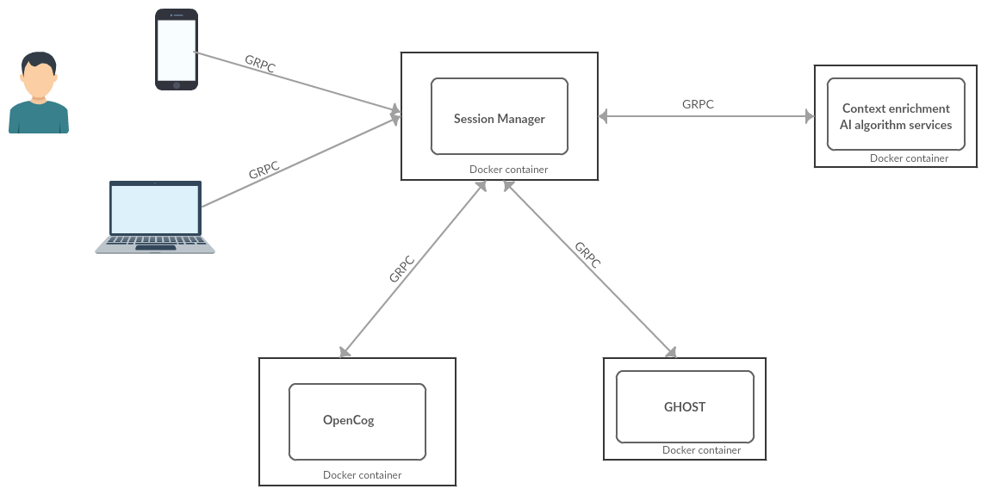
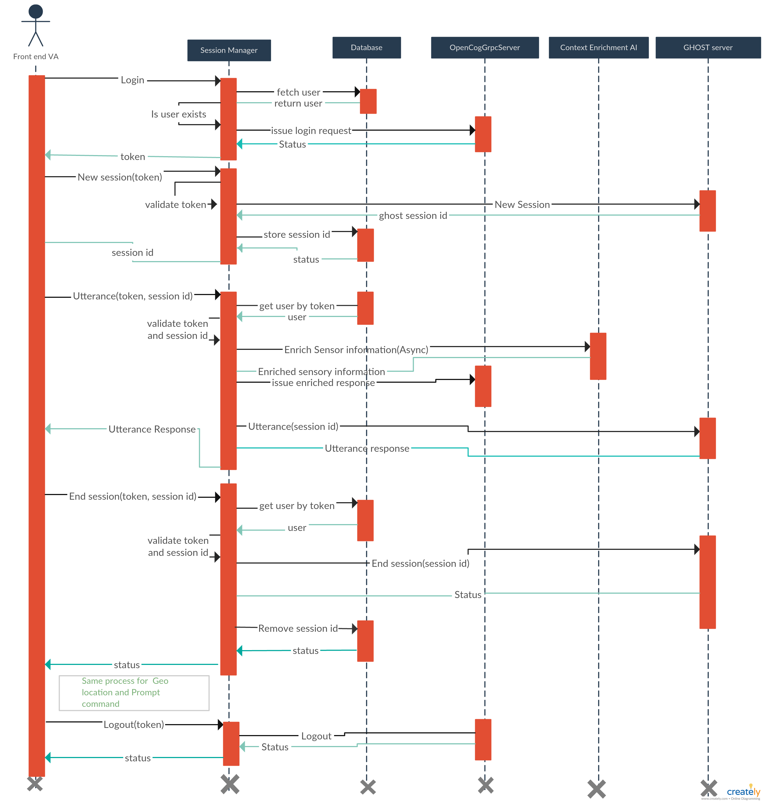

# Session manager

Session manager provides user authentication and processes all client (VA interface e.g. Android app) requests, routes them to the proper components,
and returns respective responses.

## Getting Started

```
./manage.py build va_session_manager
./manage.py launch va_session_manager
./manage.py serve va_session_manager
```

Use `session_manager_admin.py` module to help configure your db


```python
from session_manager_admin import add_credential, add_service

add_credential(username='username 1', password='password 1')
add_service('SENTIMENT_ANALYSIS', 'localhost', '50021')
add_service('NAMED_ENTITY_RECOGNITION', 'localhost', '50022')
```

## Functionalities

* **User authentication** - Securely verify that the calling user is who they claim to be.
* **API/Session key Identification** - verify user's session key and checks whether the user has permission to make an API request.
* **Session Management** - controls which containers should be created/reused to deal with requests from several different users.

## Architecture design


Fig 1.0:- shows how the session manager interacts with different components to handle a user's request.

## Components

The Session manager interacts with 5 components to handle the session management

1. Front End VA (e.g Android app, Desktop app ...etc)
2. Opencog engine (a dedicated container for each user)
3. Ghost engine
4. Context enrichment AI algorithms/auxiliary servers
    
## Session Management 

There are two kinds of session that the session manager mediates:

1. **Token**:- Securing multiple requests to a session manager from the same user.
   A session is initialized by authenticating a users and once the user is authenticated,
   subsequent requests authenticate the session as opposed to the user themselves.
    1. Request for authentication/start session(Login with user name and password)
    2. N commands 
    3. Log out (End session)
2. **Ghost session ID**:- Controlling two or more conversation sessions from the same user
    1. Start session (creates a new session id)
    2. Exchanges utterances USER<==>VA accordingly using utterance commands(using the session id)
    3. End session (deletes or reset the session)

## Methods

The session manager provides the following methods

### Login
       
```
Description: Authenticate VA users.

input: string (user name and password)

output: string (token/API key)
  
routing: This command is routed to Opencog
```

### New session/conversation

```    
Description: every time the user speeches the activation phrase (e.g. "Hi Jiva") it creates a new ghost session for the user.

input: String (token key) 

output: a ghost sesssion id

routing: This comand is routed to Ghost server engine
```

### Utterance

```
Description: The user directed an utterance to VA which always responds with another utterance

input: string (a user's utterance, token and  ghost session id)

output:  string (VA's utterance)

routing: This command is routed to Opencog Ghost server and Context enrichment AI services.
```

### End session

```
Description:  After a couple of seconds of silence the app assumes the user have finished with that request and sends a end session command to Ghost server.

Input: (token and ghost session id)

output: Status

routing: This commandis routed to Opencog Ghost server
```

### geolocation

```
Description: Inform user's current geolocation

input: int, int (latitude and longitude)

output: none

routing: This command is routed to Opencog and context enrichment AI services(Resturant information server)
```

### prompt

```
Description: Check if OpenCog have some command to send to the app (e.g. face expression, spontaneous utterances, etc)

input: none

output: string
```

### logout

```
Description: requests the end of the current session

input: token          

output: status

routing: This command is routed to Opencog
```


## Interaction with OpenCog server

Each user has a dedicated OpenCog instance.

When the user is authenticated to the session manager, the user's request will be routed to
a specific opencog instance that is registered for the user.

The session manager stores the user's credentials along with the address and port of opencog server
(that the user's request will be routed in to) in the database.
    
``` 
token

user_name

password

opencog address

opencog port
```

After the session manager successfully authenticates a user, it fetches the opencog address and port
from the database and it creates a GRPC client stub (or reuses if already created) and the stub is used
to issue the user's command to OpenCog server and return the result to the front end VA.

The session manager also return a token to the front end VA so that the front end VA passes the token
along with each command that the user would request. The token helps the session manager to identify
the requesting user.

If a user tries to login from multiple device using the same user name and password, the session manager
assigns the same token and the user's command will be routed to the same opencog server.

After N commands issued from the front end VA to the session manager (also after routed to opencog server),
the front end VA issues `Logout` command to end the user's session.

(Joel: Why do we log out after exactly N commands instead of using a timeout?)

## Interaction with Ghost server

The Session manager interacts with Ghost to manage two or more conversations for the same user.

### New session
 
- every time the user speeches the activation phrase (e.g. "Hi Jiva")

- the front end VA(Android app) issues **New session** command to the session manager

- the session manger issues **New session** to the **Ghost server**.

- The Ghost server then  creates a new ghost session and return the **ghost session id**.

- The Session manager stores the **session id** to the database

```
TOKEN             GHOST_SESSION_ID
----------------------------------
AX3SBCLJ3LSDF       1
AX3SBCLJ3LSDF       2
NBJKJ3SSS44DS       3
```

- Returns the **session id** to the front end VA(Android app)

- The front end VA uses the **session id** to issue **Utterance** command to the session manager.

### Utterance
   
- The front end VA issues **N Utterance(token, ghost session id)** commands to the session manager

- The session manager checks the token to identify the requesting user and ghost session to check
  whether the user created the ghost session

- The session manager issues **Utterance(session id)** command to **Ghost server**

- The ghost server returns **VA utterance response** to the session manager

- The session manger returns the **utterance response** to the requesting front end VA
   

### End session
 
- After exchanging **utterances** USER<==>VA accordingly using utterance commands. After a couple 
  of seconds of silence the front end VA app assumes the user have finished with that request and
  sends a **End session command**.

- The session manager checkes the token and ghost session id

- The session manager issues **End session(ghost session id)** command to **Ghost server**

- Ghost server ends the session and returns the status to session manager.

- The session manager checks the status and deletes the ended session from the database.

- Return the status to the front end app.

## Interaction with Context Enrichment servers

* Context enrichment servers are used to enrich/enhance the sensory information that would be sent
  from the front end VA (e.g Android app) to augment a VA's decision-making.

* Session Manager has one command (one method, using GRPC terminology) for each sensory information fed by the front-end.
  "utterance", "geolocation", etc. The context enrichment AI algorithms generate more information based on the sensor
  information received. The enriched sensory information is then sent to OpenCog.

* Session Manager is aware of IP/PORT (using database) of servers providing each context enrichment AI service.
 
* Different methods are enriched by a different set of servers:
  - *utterance*:
    - Sentiment Analysis
    - Named Entity Detector
  - *geolocation*:
    - Restaurant information - VA engine will request information for restaurants in that city. This ensures the information
      ready to be gotten when the user actually make a request that requires restaurant information
    
* Context enrichment server information is stored in the database.

```
SERVICE_NAME                 SERVICE_ADDRESS    SERVICE PORT
-------------------------------------------------------------
'SENTIMENT_ANALYSIS',        'localhost',         '50021'
'NAMED_ENTITY_RECOGNITION',  'localhost',         '50022'
'RESTAURANT_INFO_SERVICE'    'localhost'          '50023'
```

* Whenever the front-end issues the command **utterance** or  **geolocation**, the session manager issues
  opencog engine for **utterance**  or **Geolocation** and it will also issues any attached AI services
  commands as well (in the example, Session Manager would issue a command to
  **Sentiment Analysis and Named Entity Detector** or **Restaurant Information server**)
  and asynchronously deliver any returned **enriched sensory** results to opencog server.

(Joel: The above statement is unclear. Does the session manager forward the enrichment server results to
opencog, after it has already forwarded the utterance/geolocation command? If not, why do we say "asynchronous"?

## Sequence diagram



## gRPC Health Checking Notes

[GRPC Health Checking Protocol](https://github.com/grpc/grpc/blob/master/doc/health-checking.md)

- Python module: [grpcio-health-checking](https://pypi.org/project/grpcio-health-checking/)
- Available for [other grpc supported languages too](https://github.com/grpc-ecosystem/grpc-health-probe)

    pip install grpcio-health-checking==1.19.0 

Server health status can be one of

``` 
UNKNOWN = 0
SERVING = 1
NOT_SERVING = 2
```

### Client

Sample code for how to check either session manager's or a specific opencog server's health:

```python
import SessionManager_pb2
import SessionManager_pb2_grpc
from grpc_health.v1 import health_pb2 as heartb_pb2
from grpc_health.v1 import health_pb2_grpc as  heartb_pb2_grpc

channel = grpc.insecure_channel('localhost:50000')
session_stub = SessionManager_pb2_grpc.SessionManagerStub(channel)
health_stub = heartb_pb2_grpc.HealthStub(channel)
```

Since one opencog instance server will be created for each VA user so the client only checks the health of the Session manager and one opencog server that going to be used for this client. To tell the session manager which opencog server to test, the client should pass ``` username ``` to check the server health status. A client can check the health of both ``` SessionManager``` and ``` Specific opencog server(using username) ```

```python
def check_server_health(username):
        try:
            response = health_stub.Check(heartb_pb2.HealthCheckRequest(service=username), timeout=10)
            if response!=None and response.status == 1:
                return True
            return False
        except Exception as e:
            # if the session manager is either down or got network problem,
            # it will raise timeout/unknown exception
            return False

session_id = ''
if(check_server_health(username="username 1")):
        response = stub.Login(SessionManager_pb2.LoginInput(
                              user="username 1",
                              password="password 1"))
        session_id = response.token
                              
if(check_server_health(username=username 1")):
        response = stub.Utterance(SessionManager_pb2.UtteranceInput(
            utterance="Hello from VA user one", token=session_id))
            
```

Note: don't forget to pass the correct username when you want to test the health. 
